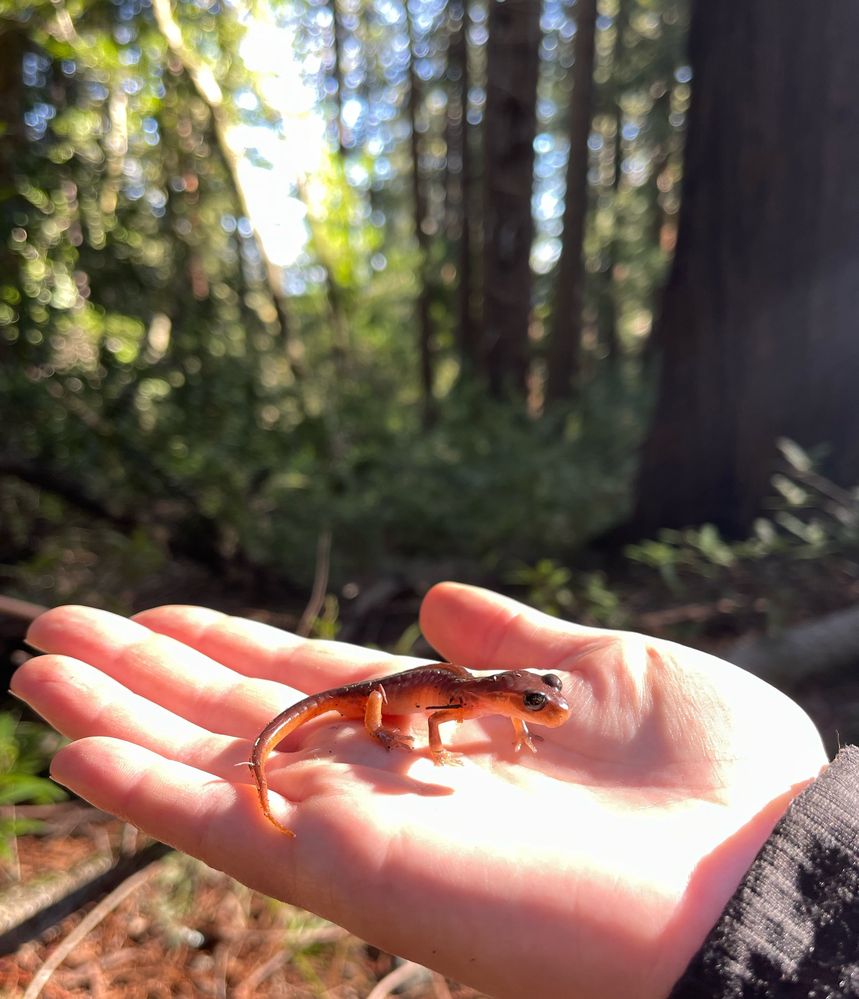

<!-- README.md is generated from README.Rmd. Please edit that file -->

```{r, include = FALSE}
knitr::opts_chunk$set(
  collapse = TRUE,
  comment = "#>",
  fig.path = "man/figures/README-",
  out.width = "100%"
)
```

# MVZ library color palettes


The Grinnell-Miller library at the [Museum of Vertebrate Zoology](https://mvz.berkeley.edu/) at UC Berkeley contains an impressive collection of historical books, including biologists' field notes, as well as textbooks, and bound journals.

During the [MVZ weekly lunch seminars](https://mvz.berkeley.edu/mvz-lunch/) which take place in the library, I would often admire the colors of the books, their spines worn over time into a collection of faded colors. I had the thought that it might be fun to use these colors as R color palettes.

## Installation

------------------------------------------------------------------------

The MVZlibrary package is only available on Github, and so must be installed using the `devtools` package. To do so:

``` r
devtools::install_github("eachambers/MVZlibrary")
```

## Usage

```{r libs, message=FALSE}
# Load library
library(MVZlibrary)
library(tidyverse)
library(cowplot)
theme_set(theme_cowplot())

# See all available palettes
names(MVZ_palettes)

# See whether palette is colorblind friendly
library(colorblindcheck)
MVZ_cb("LifeHistories")
```

## Palettes

------------------------------------------------------------------------

In total, there are seven palettes available in the `MVZlibrary` package. Three are qualitative, two are diverging, and two are monochromatic. You can have the package tell you which is which using the `MVZ_type()` function. For example:

```{r palette types}
# See all available diverging palettes
MVZ_type("diverging")
```

### Field notes

The MVZ has many historical handwritten field notes from notable biologists which have been bound and live in wooden display cases, and this palette mimics the colors both of the wood and the bound notes themselves. Field Notes is a qualitative palette with seven colors.

```{r field notes, fig.width=3, fig.height=1}
MVZ_palette("FieldNotes")
```

### Ensatina



Ensatina is a monochromatic scale palette. Its inspiration is the well-known (in the herpetology world, at least!) salamander that ranges from British Columbia, along the coastal U.S. states, and down into Baja. This genus was made famous by the late Dave Wake, curator of the MVZ, who spent much of his career researching this group of salamanders. Coincidentally, many of the books in the MVZ library have colors that remind me of this charismatic little animal.

```{r ensatina}
MVZ_palette("Ensatina")
```

### Western Birds

```{r west birds}
MVZ_palette("WesternBirds")
```

### Natural History

```{r nat hist}
MVZ_palette("NaturalHistory")
```

### Life Histories

```{r life hist}
MVZ_palette("LifeHistories")
```

### The Auk

The MVZ library has an impressive collection of bound copies of the journal [*The Auk*](https://www.jstor.org/journal/auk) (now called *Ornithology*). The Auk palette is diverging.

```{r auk}
MVZ_palette("theAuk")
```

### Zoology


Zoology is a monochromatic palette in browns and tans.

```{r zoo}
MVZ_palette("Zoology")
```

## Examples

------------------------------------------------------------------------

Below are some examples of the `MVZlibrary` palettes. As you can see, the palettes can be used quite easily with ggplot2 syntax.

```{r examples, message = FALSE}
ggplot(Orange, aes(x = circumference, y = age, color = Tree)) +
  geom_point(size = 3, alpha = 0.8) +
  scale_color_manual(values = MVZ_palette("LifeHistories"))

pal <- MVZ_palette("Ensatina", 12, type = "continuous")
image(volcano, col = pal)

ggplot(faithfuld, aes(waiting, eruptions)) +
  geom_raster(aes(fill = density), interpolate = TRUE) +
  scale_fill_gradientn(colors = MVZ_palette("Zoology"))

pal <- MVZ_palette("LifeHistories", 100, type = "continuous")
heatmap(as.matrix(mtcars), col = pal)
```

## Acknowledgements

------------------------------------------------------------------------

Much of my code, and the general structure of this package, was inspired by the `wesanderson` package developed by Karthik Ram (find it [here](https://github.com/karthik/wesanderson)), and the `NatParksPalettes` package developed by Kevin Blake (find it [here](https://github.com/kevinsblake/NatParksPalettes)). For advice on use of color in data visualization, I highly recommend the wonderful, and fully open access, *Fundamentals of Data Visualization* textbook by Claus Wilke, available online [here](https://clauswilke.com/dataviz/).

## Rave reviews

------------------------------------------------------------------------

"Oh, so a color palette based on a bunch of dusty old books?" - Erik Enbody
