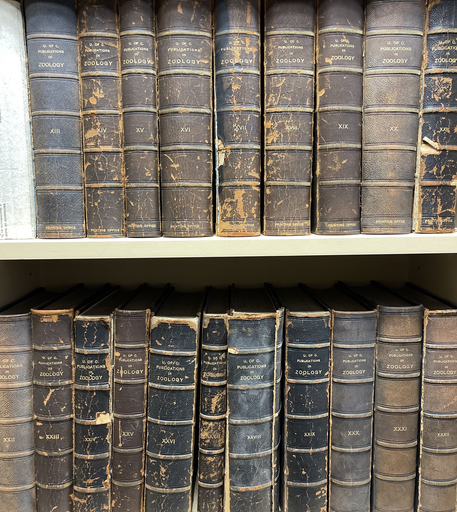

# MVZ library color palettes


The Grinnell Miller library at the [Museum of Vertebrate Zoology](https://mvz.berkeley.edu/) at UC Berkeley contains an impressive collection of historical books, including biologists' field notes (dating back to TODO!), as well as textbooks, bound journals, etc.

During MVZ weekly seminars which take place in the library, I would often admire the books surrounding me, their spines worn over time into a collection of faded, but rather lovely, colors. I had the thought that these colors might be fun to develop an R color palette with.

## Installation

The MVZlibrary package is only available on Github, and so must be installed using the `devtools` package. To do so:

```{r install}
devtools::install_github("eachambers/MVZlibrary")
```

## Usage

```{r usage}
# Load library
library(MVZlibrary)

# See all available palettes
names(MVZ_palettes)
```

## Palettes

In total, there are seven palettes available in the `MVZlibrary` package. Three are qualitative, two are diverging, and two are monochromatic. You can have the package tell you which is which using the `MVZ_types()` function. For example:

```{r palette types}
# See all available diverging palettes
MVZ_types("diverging")
```

### Natural History

Natural History is a qualitative palette TODO

```{r nat hist}
MVZ_palette("NaturalHistory")
```

### Life Histories

Life Histories is a diverging palette, inspired by TODO

```{r life hist}
MVZ_palette("LifeHistories")
```

### The Auk

The MVZ library has an impressive collection of bound copies of the journal [The Auk](TODO), dating back to around TODO. The Auk palette is diverging, ranging from deep blues to warm maroons.

```{r auk}
MVZ_palette("TheAuk")
```

### Zoology



TODO Zoology is a monochromatic palette in browns and tans.

```{r zool}
MVZ_palette("Zoology")
```

### Field notes

The MVZ has many historical hand-written field notes from notable biologists which have been bound and live in wooden display cases, and this palette mimics the colors both of the wood and the bound notes themselves. Field Notes is a qualitative palette with seven colors.

```{r field notes}
MVZ_palette("FieldNotes")
```

### Ensatina


Ensatina is a monochromatic scale palette. Its inspiration is the well-known (in the herpetology world, at least!) salamander that ranges from British Columbia, along the coastal U.S. states, and down into Baja. This genus was made famous by the late Dave Wake, curator of the MVZ. Dr. Wake spent much of his career researching this group of salamanders. Coincidentally, many of the books in the MVZ library have colors that remind me of this charismatic little animal.

```{r ensatina}
MVZ_palette("Ensatina")
```

### Western Birds

```{r west birds}
MVZ_palette("WesternBirds")
```

## Examples

Below are some examples of the `MVZlibrary` palettes. As you can see, you can adapt these palettes for use in `ggplot2()` using TODO functions.

## Acknowledgements

Much of my code, and the general structure of this package, was inspired by the `wesanderson` package developed by Karthik Ram (find it [here](https://github.com/karthik/wesanderson)), and the `NatParksPalettes` package developed by Kevin Blake (find it [here](https://github.com/kevinsblake/NatParksPalettes)). For advice on use of color in data visualization, I highly recommend the wonderful, and fully open access, *Fundamentals of Data Visualization* textbook by Claus Wilke, available online [here](https://clauswilke.com/dataviz/).
